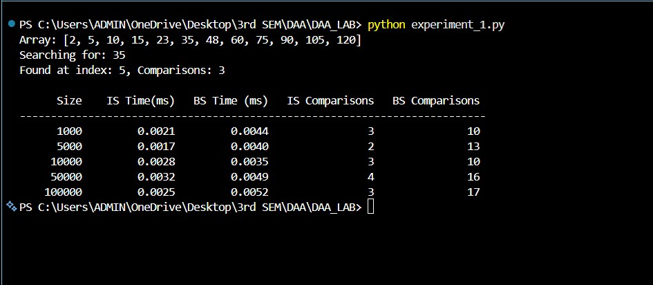

# CS5303 DAA Lab Outputs

* Experiment 1 – Implementation and Performance Analysis of Interpolation Search
  

* Experiment 2 – Comparative Analysis of Naive, Rabin-Karp, and KMP Algorithms for String Matching
  

* Experiment 3 – Implementation of Kruskal's and Prim's Algorithms for Minimum Spanning Tree
  